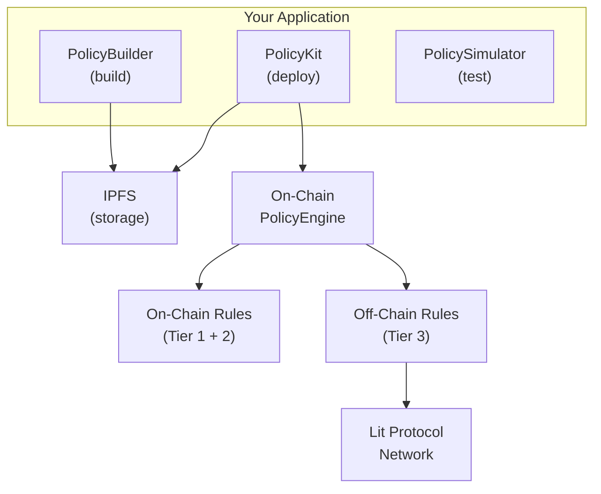

# Architecture

PolicyKit is designed as a layered system where each component has a clear responsibility. This page explains how the pieces fit together.

## System Overview

## Component Responsibilities

### SDK Layer

The SDK provides the developer-facing API:

| Component | Responsibility |
|-----------|---------------|
| `PolicyBuilder` | Construct policies using a fluent API |
| `PolicyKit` | High-level orchestration — deploy, update, remove policies |
| `PolicyEngineClient` | Typed wrapper for `PolicyEngine` contract calls |
| `PolicySimulator` | Local evaluation for testing and development |
| `IPFSClient` | Pin and retrieve policy JSON from IPFS |
| `LitClient` | Interact with Lit Protocol for off-chain evaluation |
| `PolicyEncoder` | Encode/decode policies for on-chain storage |

### Smart Contract Layer

The on-chain contracts enforce policies at the transaction level:

| Contract | Responsibility |
|----------|---------------|
| `PolicyEngine` | Stores policy sets, dispatches rule evaluation |
| `PolicyGuard` | Guard hook for smart accounts |
| `PolicyKit7579Module` | ERC-7579 module for compliant smart accounts |
| Rule Evaluators | Individual contracts per rule type |
| `AttestationVerifier` | Verifies EIP-712 signed attestations from Lit |

### Off-Chain Layer

Lit Protocol handles rules that require external data or complex computation:

| Component | Responsibility |
|-----------|---------------|
| `policyEvaluator.action.ts` | Main Lit Action that evaluates Tier 3 rules |
| Rule evaluators | Individual evaluators (slippage, simulation, custom) |
| PKP (Programmable Key Pair) | Signs attestations when rules pass |

## Data Flow

### Policy Deployment

1. Developer builds a policy with `PolicyBuilder`
2. Full policy JSON is pinned to IPFS via `IPFSClient`
3. On-chain rules are encoded via `PolicyEncoder`
4. `PolicyEngine.setPolicySet()` is called with:
   - Policy CID (as `bytes32`)
   - PKP address (for attestation verification)
   - Encoded on-chain rules
   - Fail mode and attestation requirements

### Transaction Evaluation

1. A transaction is submitted to the smart account
2. `PolicyGuard` or `PolicyKit7579Module` intercepts it
3. On-chain rules (Tier 1 and 2) are evaluated by the `PolicyEngine`
4. If off-chain rules exist, a Lit Action is triggered
5. The Lit Action fetches the policy from IPFS using the CID
6. Off-chain rules (Tier 3) are evaluated
7. If all rules pass, the Lit network threshold-signs an EIP-712 attestation
8. The attestation is verified on-chain by `AttestationVerifier`
9. Transaction proceeds only if all checks pass

## Security Model

### Trust Assumptions

- **On-chain rules**: Fully trustless — evaluated by the EVM
- **Off-chain rules**: Trust the Lit Protocol network's decentralized TEE infrastructure
- **IPFS storage**: Content-addressed — CID ensures policy integrity
- **Attestations**: EIP-712 typed signatures verified on-chain

### Attack Surface

PolicyKit minimizes the attack surface by:

- Keeping critical rules on-chain where possible
- Using threshold cryptography (no single point of failure for attestations)
- Content-addressing policies on IPFS (tamper-evident)
- Supporting "closed" fail mode for high-security deployments
